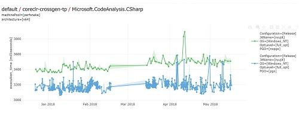
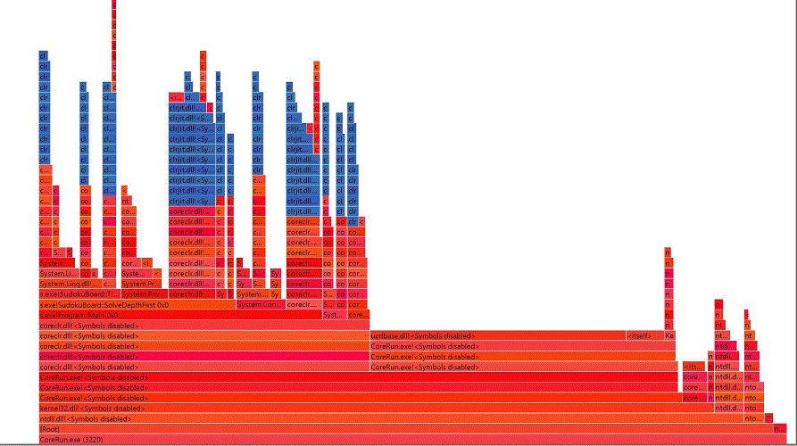
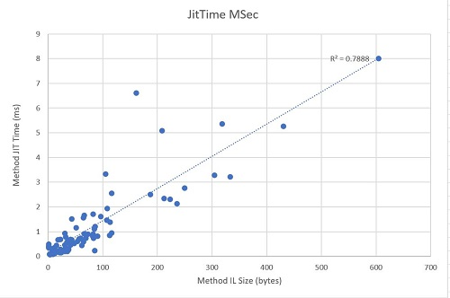
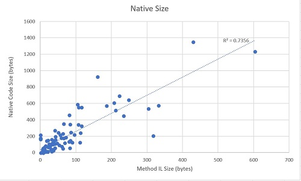

# Jit Throughput

This document describes work to improve Jit throughput.

## Overview of Proposed Work

The proposed work falls into four broad areas:
* Act on well understood [opportunities](#Current-Opportunities)
* [Investigate](#Investigations) to uncover new ideas and opportunities
* Invest in [tooling](#Throughput-Measurements) to improve the ability to
  measure and understand jit throughput
* Invest in [infrastructure](#Infrastructure) to track progress and measure
  realistic scenarios

Each of these is explored in more detail below. Various other notes are also
captured in the [Appendix](#Appendix).

Throughput work is often difficult to plan in advance. The proposed work that
follows contains many investigative tasks that may uncover data which
substantially alter the plans and achievable goals. 

So, please consider this very much a rough draft.

## Background

**Jit throughput** is the speed at which the jit can generate code. In .Net Core
and .Net Framework, the jit runs in-process with the .Net application. So time
spent jitting impacts the overall execution time of applications, sometimes
dramatically. The impact is usually most noticeable early in the life of the
application, where it impacts startup time. But the jit can also be invoked
later on. So it behooves us to understand and to minimize the time spent
jitting. The jit can also impact the application's performance by using memory,
and so we generally include the impact of the memory footprint of the jit in the
throughput category as well.

The jit has different codegen modes:
* **Fast jitting** (debug / tier0): here the goal is to jit to native code as
  quickly as possible. Performance of the native code is a secondary concern.
  Optimizations are either disabled (to improve debug fidelity) or minimized (as
  they tend to be slow).
* **Optimized jitting** (release / tier1): here the goal is to strike a reasonable
  balance between the time spent jitting and the performance of the native code.
* **Robust jitting** (minopts): a mode that is used to ensure that optimizations
  don't cause .Net applications to fail. Used for very large methods, methods that
  are known only to execute once (class constructors), and methods where the jit
  has encountered a recoverable failure when optimizing.
* **Pre jitting** or AOT compilation (crossgen / ngen / CoreRT): here the jit is
  actually run out of process before the application executes. Typically the jit
  must generate code for most or all of the methods in an assembly, so despite
  running ahead of time, in this mode throughput is still an important
  consideration.

In current practice, minopts is similar enough to debug / tier0 that for now we
can consider it part of "fast jitting." And prejtting (usually) is done on
release version of code, so it can considered part of "optimized jitting".

The VM selects the initial codegen mode for each method. Selectively, the jit
may downgrade to minopts, as noted above.

Aside from the native code the jit must also produce some side data: GC info, EH
info, unwind info, and debug info. Construction of this data can be costly and
is also a part of jit throughput.

Note there is currently no "maximum optimization" codegen mode.

## Fast Jitting

For fast jitting, the goal is to create the native code (and related side data)
as quickly as possible. This means:
* little or no optimization
* careful preservation of debug artifacts (eg "nops" in IL)
* minimal special-case analysis
* simplified GC info production

Improvements in fast jitting lead to a better "F5" developer experience when
launching .Net apps from a debugger and faster application startup when using
Tiered Jitting.

The quality of fast jitted code is a secondary concern, but cannot be completely
ignored. The time spent fast jitting depends in part on the volume of native
code generated, so some attention must be paid to code size as well.

## Optimized Jitting

For optimized jitting, the goal is to create high-quality native code (and
related side data) but still have the jit run relatively quickly. This means:
* Optimization costs need to be carefully controlled
* Optimizations should be "pay for play" and only incur costs when they provide
  benefit
* Even when optimizing, overall jit throughput is fairly well correlated the
  volume of native code generated, so we must carefully engineer code-expanding
  optimizations like inlining and loop transformations.

Improvements in optimized jitting throughput will lead to faster app startup and
more effective tiered jitting. They may also open the door for us to consider
adding more optimizations.

## Current Opportunities

Past investigations have created a backlog of around 35 throughput issues. The
most promising of these are:
* [#3408](https://github.com/dotnet/coreclr/issues/3408) Look at how efficiently
  the jit requests memory.
* [#7453](https://github.com/dotnet/coreclr/issues/7453) Reduce time spent in
  calls through ICorJitInfo.
* [#7457](https://github.com/dotnet/coreclr/issues/7457) Reduce cost of fast
  jitting by simplifying IR.
* [#13280](https://github.com/dotnet/coreclr/issues/13280) Local var ref
  counting impact on throughput.
* [#14474](https://github.com/dotnet/coreclr/issues/14474) Run some simple
  optimizations in tier 0.

A very rough guess is that the work above would speed up fast jitting by 5% or
so.

Optimized jitting would also benefit, perhaps especially so when prejtting.

## Investigations

### Comparative Studies

We can often learn a lot by looking at performance relative to other .Net jits.
In particular we can compare the performance of RyuJit to Jit32 (for x86) and to
the Mono jits and perhaps the Mono interpreter. Interpretation can be tricky at
times.

We can also compare the throughput of RyuJit over time, to try and ensure we are
improving and not regressing. Note the input assemblies may also be changing,
which can complicate the comparison process.

We can compare cross-architecture or cross-os, to try and ensure that say x86
jit throughput is comparable to x64 jit throughput, or Linux jit throughput is
comparable to Windows jit throughput.

Open issues:
* [#7034](https://github.com/dotnet/coreclr/issues/7034) Arm32 jit performance
  vs Mono jit
* [#12454](https://github.com/dotnet/coreclr/issues/12454) Comparative
  throughput of x86 vs x64 in .Net Core 2.0.

Anecdotally we have heard that the performance of Roslyn on Mono is often better
than on .Net Core. Roslyn performance (without the compile server) is often
dominated by jit throughput. So this is worth further investigation.

### Impact of the Jit-EE Interface

In .Net Core (and .Net Framework), the jit needs the runtime's (aka the
Execution Engine or EE)'s help in understanding MSIL. In particular, the jit
will ask the runtime to decode tokens, signatures, and the like. The results are
often represented by various opaque handles. These handles can subsequently be
passed back from the jit to the runtime to answer further questions.

For example a token in MSIL might map to a the runtime representation for a
class, represented by a `CORINFO_CLASS_HANDLE`. This handle type is opaque to
the jit but not to the runtime. To determine properties of the class the jit
needs to call back into the runtime. For instance the jit can invoke
`isValueClass(handle)` to discover if the class is a ref class or a value class.

A certain amount of Jit-EE interface traffic is required when jitting.  But not
all such traffic is strictly required. The jit may invoke Jit-EE interface calls
repeatedly, or unnecessarily, or speculatively, or as part of an optimization
phase. And the design and implementation of the interface are also open to
question.

So it would be ideal to try and tease apart the *necessary* Jit-EE interface
costs from the optional costs, and try and optimize the former and minimize the
latter.

The Jit-EE interface is fairly broad and currently has about 150 methods. These
methods are interfaces as the jit may be invoked in different contexts -- one
implementation of the interface is found in the runtime, another in the crossgen
tool that drives prejitting, another in the driver used by CoreRT, and others in
specialized testing tools like SuperPMI.

Open issues:
* [#7453](https://github.com/dotnet/coreclr/issues/7453) Reduce time spent in
  calls through ICorJitInfo.

This is an area that deserves closer scrutiny. We should leverage the SPMI
infrastructure (or similar tech) to look for cases where the jit is invoking a
Jit-EE interface repeatedly with the same arguments when jitting a method.
### Jit Implementation Fundamentals

We can improve implementation of the jit by removing inefficiencies and
streamlining the work the jit must perform.

Open issues (subset):
* [#1043](https://github.com/dotnet/coreclr/issues/1043) Look in to temp reuse
  during importation.
* [#3408](https://github.com/dotnet/coreclr/issues/3408) Look at how efficiently
  the jit requests memory.
* [#7457](https://github.com/dotnet/coreclr/issues/7457) Reduce cost of fast
  jitting by simplifying IR.
* [#7458](https://github.com/dotnet/coreclr/issues/7458) Reduce size of jit data
  structures by eliminating padding.
* [#10422](https://github.com/dotnet/coreclr/issues/10422) Look at impact of
  `SimplerHashTable`.
* [#10423](https://github.com/dotnet/coreclr/issues/10423) Look into the
  peanut-butter costs from usually inlined methods.
* [#13280](https://github.com/dotnet/coreclr/issues/13280) Local var ref
  counting impact on throughput.
* [#10731](https://github.com/dotnet/coreclr/issues/10731) Selective importation
  by more aggressively folding branches. We do some of this already in optimized
  jitting; the idea here is to extend it (where suitable) to fast jitting.
* [#14474](https://github.com/dotnet/coreclr/issues/14474) Run some simple
  optimizations in tier 0.

There are also a number of issues specific to the register allocator (RA), which
broadly speaking takes up about 20% of fast jitting time (I should add a typical
profile to the Appendix).
## Throughput Measurements

We measure throughput currently by crossgenning a set of assemblies. Data is
gathered on a rolling basis and archived in //benchview. For example here is the
recent history for time spent crossgenning Microsoft.CodeAnalysis.CSharp in
CoreCLR master:

We can see PGO provides a throughput reasonable benefit, around 6% or so, and
that the data is fairly noisy.

The crossgen timing data is probably is sufficient for discovering serious
throughput regressions. But most jit team members haven't found this sort of
data to be useful in day to day development work. Issues include:
* noise level too high to measure most jit throughput improvements or regressions
* not all that easy to aggregate results across assemblies
* crossgen only touches on some code paths in the jit
* time spent jitting is typically about 2/3 of total crossgen time. So, the
  impact of regressions and improvements is a bit muted.

So we likely need to foster the development of some alternative measurement
approaches. Below are some ideas.

### Measurement Approaches

| Driver | Measurement | Per-Method | Per-Phase | Noise | Details    |
| ------ | ----------- | ---------- | --------- | ----- | -----------|
| App | ETW | Yes | No | Med | Enable jit ETW events, then post-process ETL |
| App | jit time log | Yes | No | ? | Enable internal jit logging | 
| App | profiler | No | Yes | Med | CPU cycle sampling |
| App | HW counter | No | Yes* | Low | Inst Retired Sampling |
| App | ETW + Sampling | Yes | Yes | Med | jit ETW events plus CPU samples |
| App | Pin | No ? | No ? | Low | Pin-based instruction counting |
| SPMI | SPMI timer | Yes | No | Low ? | SPMI replay of app or crossgen |
| PMI | (same as App) | Varies | Varies | Varies | Uses PMI to increase coverage |
| CoreRT | ? | ? | ? | ? | Drive jit via CoreRT |
| Crossgen | Overall | No | No | High | time how long crossgen takes |
| Crossgen | HW counter | No | Yes* | Low | Inst Retired Sampling |
| Crossgen | profiler | No | Yes | Med | CPU cycle sampling |

Notes on the driver:
* App: run an app (or set of apps) to measure jit throughput impact.
* SPMI: use SPMI to capture jit behavior, then replay it. Requires large,
  fragile data files to hold the replay data.
* PMI: use PMI (Prepare Method) to forcefully jit large numbers of methods
* CoreRT: use CoreRT to jit large numbers of methods
* Crossgen: use crossgen to prejit large numbers of methods.

Notes on the measurement approaches:
* ETW: the VM can emit even trace records for jit activity. These can be logged
  and the log data mined to produce detailed measurements of the time spent
  jitting, both for methods, assemblies, and entire processes. For instance
  perfview will enable this by default. Overhead is fairly low. Measurement are
  time based so probably a little noisy. All of this is easily scriptable.
  Requires ADMIN rights on Windows.
* Jit Time Log: the jit can internally track the time spent jitting, including
  per method and per phase times. Output is a text file .
* Sampling profile: traditional profiling can show exclusive/inclusive time in
  the jit.
* HW Counter: sampling on instructions retired can give considerably more
  repeatable measurements (noise levels ~0.1% or so). This is easily scripted;
  see for instance the [Instructions Retired
  Explorer](https://github.com/AndyAyersMS/InstructionsRetiredExplorer).
* ETW + Sampling: should be able to give per-method per-jit artifact
  tabulations. However may not get many samples in small methods.
* SPMI: use SPMI replay and measure jit via SPMI timing
* [Pin](https://software.intel.com/en-us/articles/pin-a-dynamic-binary-instrumentation-tool)
  uses dynamic binary instrumentation. A number of jit developers have used this
  successfully.

Notes on coverage:
* App coverage is likely to be sporadic and will only include jitted code.
* SPMI potentially offers the best coverage as it can replay Jit-EE interactions
  from any other driver and even work cross-architecture.
* PMI offers good coverage but only for jitted code. Coverage can bef further
  boosted by forcing generic instantiations.
* Crossgen offers moderate coverage but only for prejitted code. Also can work
  cross-architecture. Coverage limited by lack of cross-assembly inlines and by
  NGEN/R2R codegen patterns.
* CoreRT should offer similar benefits as Crossgen and should be able to inline
  more freely.

For ongoing dev work we likely need some kind of low-noise, high coverage
measurement approach. That suggests either SPMI or a combination of PMI and
Crossgen (with HW sampling) as the go-to approaches for dev inner loops.

For longer-term tracking we may want something similar either as a replacement
for or as additional data to supplement our "time how long crossgen" runs
measurements.

### Understand Key Application Impact

As we measure throughput it is important to tie the progress back to tangible
scenarios. In particular we should look at the performance of key applications
like Roslyn and MSBuild that impact the developer's inner cycle, and the startup
time of representative applications like MusicStore. It would also be good to
set up a developer inner loop "F5" type measurement.

## Infrastructure

Ideally we would engineer the ability to measure jit throughput as part of the
CI system, and perhaps build in automated regression detection.

## Appendix

### Profiling

If you profile a .Net process via stack sampling and visualize the results (say,
via *flame graph*) you will generally see that the jit's frames sit at or near
the top of the stack. The jit is invoked by the runtime the first time a method
is called, so below the jit on the stack one typically finds some runtime
frames, and below that, some managed code frames. But there are also often
frames above the jit frames, both for runtime utilities that the jit invokes
(via the JIT-EE interface), and sometimes frames for managed code that runs as a
prerequisite to jitting some method. And in rare cases the execution of *that*
code can inspire further jitting, so there can be several layers of
managed/runtime/jit frames.

For example, the blue frames in the flame graph below show the jit frames. In
this example jitting took around 105 ms and was 32% of total process time.

To determine the total amount of time spent jitting, an *inclusive* profile
estimate is the most appropriate.

### Jit Time Distributions

The distribution of jit times is typically left-leaning with a long tail to the
right. In this example average method took about 1.02ms to jit, but the median
jit time was 0.5ms. The slowest jitting method took 8.03ms, and the fastest
0.11ms.

Jit time is also fairly well correlated with method IL size. For example a linear
regression model of the per-method jit time data from the run above shows a
correlation coefficient of ~0.79.

### Jit Output Size Distribution

Perhaps not too surprisingly the size of the jit produced code is also fairly
well correlated with the IL size:

